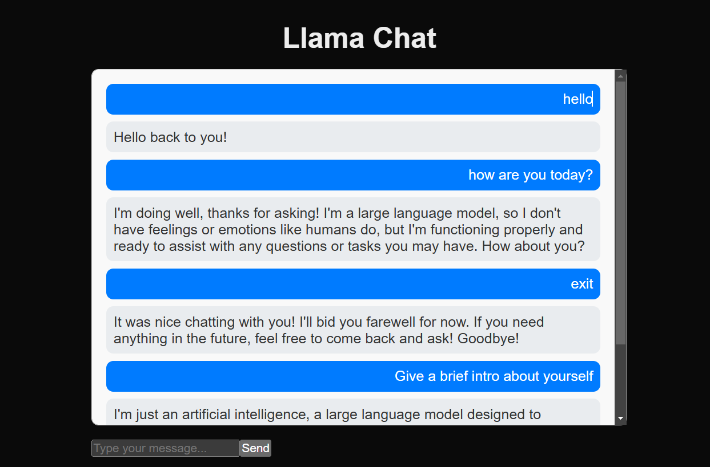

# LlamaChat

A simple Next.js application that interacts with a FastAPI-based chatbot server. Users can send messages to the chatbot and view its responses in real time. It is running the Llama 3.1 model with 8 Billion parameters.

